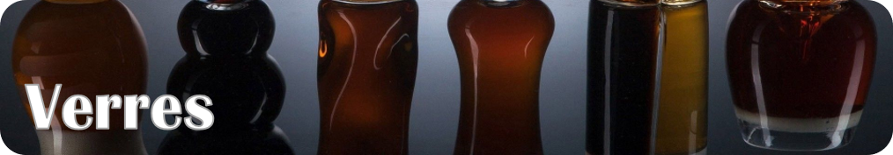
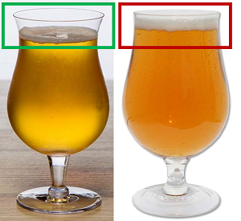
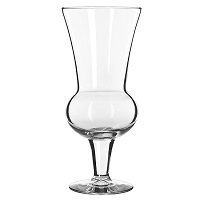
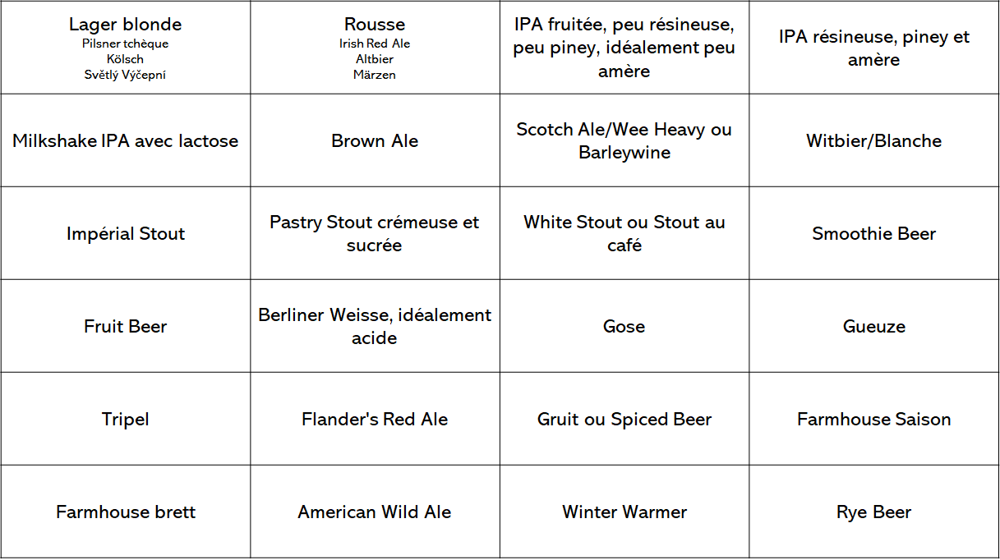
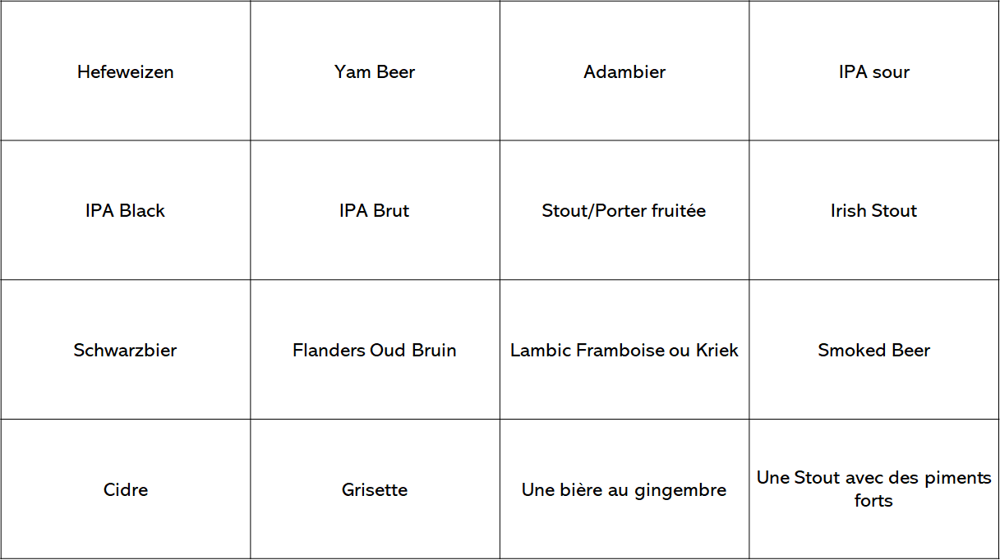
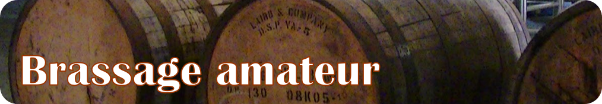

 

**Présentation**

Je suis un jeune amateur de bière. J'ai eu ma piqure au début de 2020 et depuis je me suis amusé à essayer pas mal de styles/goûts, je me suis renseigné sur les verres, l'histoire, etc. Je tenais à partager mes expériences, qui ne sont pas énormes, mais qui pourraient être une bonne source d'information pour certains 😁

Je n’ai pas goûté à Toutes les brasseries du Québec. Dans ce guide j'essaie de vous présenter assez de bonnes bières que j'ai goûtées (selon moi) pour que vous puissiez les trouver facilement. Sachez que j'habite à Montréal, donc peut-être les bières *faciles à trouver* pour moi, sont *difficiles à trouver* pour vous !

note: le profil de goût n'a pas d'ordre particulier.

Je vous conseille de jeter un coup d'oeil à cette application: [Untappd](https://play.google.com/store/apps/details?id=com.untappdllc.app&hl=en&gl=US). Elle est très à jour, complète et fiable. Vous trouverez les profils de goûts et les ratings de toutes les bières au monde ! Je la recommande !

**Table de matières:**

* Comment décrire une bière - Explication des mots
* Houblons
* Guide des styles par couleur + exemples + profil de goût
* Quel verre choisir?
  * Où les acheter
  * Le verre idéal à Avoir
* Dans quel ordre boire?
* Comment servir?
* Conservation et garde
* 24-packs
  * Pour débuter
  * Pour aller plus loin
* Produits rares et échanges
  * Bières importées
  * Brasseries rares
  * Produits rares
  * Où les échanger?
  * Valeur secondaire des bières
* Applications à avoir
* Brassage amateur À VENIR
* Contact

Cheers !

**Quelques infos:**

Je ne cherche pas à faire de pub en faisant ce guide.
Je ne suis pas payé pour faire ce guide, je le fais pour le plaisir !
Mon but est de partager mon expérience avec la bière pour initier de futurs amateurs de bière !
Toutes les informations que vous allez trouver dans ce guide ont été prises par mes nombreuses recherches sur le sujet, mes expériences, mes discussions, etc. Rien n’est techniquement officiel !
Si jamais je cite ou utilise l'une de vos marques/photos et vous n'êtes pas d'accord, je vais les enlever sans problème :)
Ceci est une première version ! Je vais l'update selon mes nouvelles découvertes :) Merci à mon ami Alex qui m'a donné pas mal de conseils avec les styles que je connaissais moins et à ceux qui m'ont aidé dans mon post sur Facebook !

---

## Comment décrire une bière - Explication des mots

À VENIR

---

## Houblons

À VENIR

---

 

### Pilsner Czech

---

**Louvain @Silo**

Céréales,
malt,
caramel,
légère

**Pilsner Czech @L'Hermite**

Céréales,
citron,
florale,
herbacée,
amertume modérée

### Pale

---

**Pivo Červený @L'Amère à Boire**

Céréales,
herbacée,
malt,
caramel,
amère (leur **Černá** est moins amère)

### Kölsch, blonde allemande

---

**Saint-Laurent @Silo**

**Sentinelle @Dieu du Ciel**

**Monsieur Madame @Ras L'Bock**

Céréales,
malt,
un peu floral,
un peu de miel,
effervescente,
rafraîchissante,
légère

### Světlý Výčepní, pilsner tchèque

---

**Světlý Výčepní 10⁰ @Isle de Garde**

La meilleure pilsner toute comprise à mon avis: 0 amère, beaucoup de céréales, gros goût présent qui reste en bouche longtemps ! Se procure uniquement chez Îsle de Garde pendant l'été.

**Coup de Foudre - Výčepní @Les Grands Bois**

(est une très bonne interprétation aussi)

Céréales,
texture cripsy,
rafraichissante,
légère

### Helles, lager allemande

(la différence entre les autres Lagers allemandes est plus sur l'histoire que sur le goût)

---

**Coup de Foudre - Helles @Les Grands Bois**

Céréales,
florale,
légère

### Hefeweizen
---
**N'importe laquelle à la SAQ**

Banane,
légère,
douce,
peu houblonée: mangue et ananas très subtiles

### Kellerbier/Zwickelbier
---
**Kellerbier de @LTM et @Vrooden**

Légère,
douce,
herbacée,
florale,
houblonnée,
crispy,
céréales

---

 

### American Red Ale, rousse américaine

---

**La Bonne Aventure @Pit Caribou**

Caramel,
cassonade,
malt rôti,
légère amertume,
légère

### Irish Red Ale, rousse irlandaise
---
**Gros Pin @La Souche**

Caramel,
malt rôti,
un peu de noisettes,
un peu terreux,
peu amère,
sèche,
très légère: le goût est pas mal subtil

### Altbier, rousse allemande
---
**Fleury @Silo**
**Altbier @Simple Malt**

Caramel,
malt,
pain grillé,
amère,
légère

### Rye, bière de seigle
---

**Conqueror @Pit Caribou**

**Fashion Victim @Les Grands Bois**

Seigle grillé,
carmel,
fumée,
*houblonnée si IPA*,
texture crispy,
smooth

### Belgian Dubbel
---
**N'importe laquelle à la SAQ**

Banane,
douce,
levures belges,
un peu crémeuse,
dark,
malt,
caramel,
crémeuse,
notes de noix et de biscuit

### Yam Beer/Pumpkin
---
**Ale-Ô-Ween @Treffle Noir**

Citrouille,
épices: clou de girofle, cannelle,
douce,
légère

### Best Bitter
---
**5 - Best Bitter @Harricana**

Caramel,
malt,
légère,
amertume faible/modérée.
*Ressemble à une lager rousse avec un goût un peu plus prononcé*

### Steinbier
---
**Voivoid Lost Machine @Hopfenstark**

Caramel (*à cause des roches ajoutées pendant le mash (la cuisson des grains)*),
malt,
sucrée,
peu houblonnée

### Rauchbier
---
**ce style est plutôt rare, demandez à votre détaillant voir ce qui est disponible !**

Fumée,
caramel,
légère

### Sahti
---
**Sahti @Oshlag**

Banane,
caramel,
alcool fort,
malt

### Adambier
---
**Adambier @Vox Populi**

Tourbée,
boisée,
amère,
maltée,
fumée,
caramel

### Märzen
---
**Märzen @Dunham ou Vrooden**

**10 - Hoptoberfest @Harricana**

Caramel,
maltée,
légère,
douce

### Maibock
---
**Maibock de @LTM**

Forte,
maltée,
caramel,
florale,
légère,
douce

---

 

### Pale Ale
---
Si vous n'aimez pas beaucoup les bières fortes ou vous avez peur de l'amertume, ce serait une bonne idée de vous initier aux IPA en goûtant des bonnes Pale Ale ! Je sais que @Brewskey et @Boréale en font des très bonnes, mais je n'ai jamais eu la chance de les goûter.

---

Par expérience, les IPA des brasseries les plus "populaires" sont difficiles à trouver (Sir John serait la plus accessible) donc je vais vous proposer d'autres IPA d'autres brasseries qui sont aussi très bonnes :D Let's go ! 

### IPAs fruitées, peu résineuses, peu piney, amertume variable

---

**Ukulele (HBC 644 & HBC 342) @Lagabière**

**Paradise Point @Pit Caribou**

**Double Descente @Boréale**

**IPA du Nord-Est @Boréale**

**Catnip @Noctem**

**Double Catnip de @Noctem**

**Tête de Pioche @Prosprecteur**

Très houblonnée,
fruits tropicaux,
agrumes,
zesty,
texture juicy et hazy

**Double Mango IPA**

Fruitée: mangue, nectarine,
houblonnée,
amère,
assez liquide

**Etc.**

### IPAs résineuses, piney et amères

---

**Moralité @Dieu du Ciel**

Agrumes,
résineux,
pamplemousse,
amère,
sèche

**IPA Américaine des Appalaches @Pit Caribou**

Houblonnée,
résineux,
floral,
herbeux,
malt,
un peu de miel,
amère

**West Coast IPA @Mille Îles**

**IPA de la Côte Ouest @Knowlton Co.**

Houblonnée,
agrumes,
fruits tropicaux,
amertume tranchante

**Bomba @Simple Malt**

Houblonnée,
résineux,
malt,
amère,
fruits exotiques

### Un mix des deux palettes

---

**Métamorphe @Le Castor**

**Lutine de @Le Castor**

Très houblonnée,
fruits tropicaux,
agrumes,
texture juicy, veloutée et hazy,
résineuse,
amère.
*Pourrait être une initiation au goût résineux si vous n'aimez pas ça*

**Ta Meilleure @Lagabière**

Fruitée,
floral / herbeux,
houblonnée,
amère

**Double Fruit Punch @Vox Populi**

Fruits tropicaux: mangue, ananas...,
très houblonnée,
amertume modérée,
entre hazy et liquide

**L'Arlequin Double IPA des Migrateurs @Pit Caribou**

Houblonnée,
piney,
résineux,
fruitée: pêche, nectarine,
agrumes,
amertume modérée

---

IPA Américaine/DIPA/TIPA/Quadruple IPA/NEIPA (les bières Américaines sont souvent plus fortes en alcool, ont plus de goûts prononcés, plus d'amertume... Plus de tout ahahaha. Les Double IPA, Triple IPA... EN GROS, plus on ajoute un gros chiffre plus c'est fort en alcool. Les NEIPA sont des IPA moins amères et beaucoup plus houblonnées et aux goûts d'agrumes prononcés, excellentes pour s'initier !)

Les IPA de la Côte Ouest et les IPA Américaine sont des IPA axées sur les goûts résineux et piney. Souvent amères et pas très fruitées.

Il y a des IPA sûres, IPA au Gingembre, IPA noires, IPA blanches, Milkshake IPA, IPA de toutes les sortes ! Je ne peux pas toutes les aborder :P, mais en voici quand même quelques-unes:

### IPA White
---
**Juteuse @Ras L'Bock**

Houblonnée,
agrumes,
texture juicy,
blé,
floral / herbeux,
levures belges,
amère

### Milkshake IPA, IPAs aux goûts de lactose et de vanille prononcés
---
**Los Tabarnacos @Brasserie du Bas-Canada**

(assez difficile à trouver et pas toujours en magasin, mais je trouve que ce sont les meilleures du style !)

**Milkshake @Le BockAle**

**Watatawow @Ras L'Bock**

Lactose,
vanille,
houblonnée,
très peu/pas amère,
souvent assez liquides/légères

### IPA Sour
---
**N'importe quelle Fructis Mortis de @Messorem Bracitorium**

(*c'est très difficile à se procurer si on ne va pas sur place, et ils ne vendent que des 4-pack. Mais c'est définitivement la meilleure du style*)

**IPA Sure @Pit Caribou**

Houblonnée,
nectarine,
prune,
pêche,
sûre,
légère amertume sèche

**Banjo @Jukebox**

Houblonnée,
ananas et tangerine (ou d'autres pour les Fructis Mortis que vous trouverez),
sûre,
un peu acide,
rafraîchissante,
texture légère

### IPA Brut
---
**IPA Cuvée Extra Brut de @MonsRegius**

Fruitée,
un petit peu piney,
agrumes,
effervescente,
très sèche,
douce amertume

### IPA Black/Cascadian Dark Ale
---
**IPA Black de @Dunham**

Crémeuse,
malts rôtis,
café,
dark,
très houblonnée

### IPA Kveik
---
**Nordicité de @Champ Libre**

Très houblonnée,
très sèche,
goût de levures Kveik,
agrumes,
piney,
crispy,
faible goût de baies de genièvre

### IPL (India Pale Lager)
---
**IXPL ou IXXPL ou New Experimental India Pale Lager @Malstorm**

Houblonnée,
Fruits tropicaux,
légère,
douce,
céreales,
malt,
amertume légère

---

 

### American/Brittish Brown Ale
---
**Castelnau @Dieu du Ciel**

**Hazel @Vox Populi**

Noix,
céréales rôties,
cendres,
café,
malt,
caramel,
amères,
texture crispy

### Barleywine/Vin d'orge
---
**Solstice d'hiver @Dieu du Ciel**

**Barleywine Américain @Pit Caribou**

**Monarque - Vin d'orge obscur @8e Péché**

Céréales rôties,
dark,
caramel,
alcool fort,
amère.
*La **Monarque** a un goût de chocolat/cacao en plus, ça pourrait être une bonne initiation à ce style*
*Celle de **@Pit Caribou** a des petites touches de fumée*

### Weizenbock
---
**Weizenbock de @LTM**

Dark,
banane,
caramel,
douce,
forte.

### Old Ale
---
**Old Ale de @Castor**

Malty,
caramel,
sweet,
intense,
alcool fort,
sèche

### Quadruple belge
---
**Rigor Mortis Abt @Dieu du Ciel**

**Abt 12 @St. Bernardus (SAQ)**

Dark,
riche,
douce,
caramel,
forte,
alcool,
levures belges

### Scotch Ale/Wee Heavy
---
**Scotch Ale Reserve @Simple Malt**

**Mackroken Flower Grande Réserve @Le Bilboquet**

**Wee Heavy @Castor**

**Équinoxe du Printemps @Dieu du Ciel**

Alcool,
caramel,
tourbée,
fruits confis

### Flanders Oud Bruin
---
**Lapsus @Benelux**

Malt grillé,
caramel,
sûre,
acidulée,
fruitée,
boisée,
peut être dark et/ou sèche

### Smoked Beer
---
**Raftman @Uniboue**

Fumée,
malt grillé,
caramel,
cassonade,
herbacée,
levures belges

---

 

---
### Imperial Stout
---
**Péché Mortel @Dieu du Ciel**
**Imperial Stout @Simple Malt**

Café,
céréales rôties,
torréfaction,
dark,
amère,
texture crémeuse

**Impériale Scotch @Beauregard**

(leurs autres bières affinées en fût de quelque chose sont très bonnes aussi !)

Chocolat,
noisette,
dark,
scotch (*bonne initiation au goût de Whisky/Scotch/Bourbon*),
un peu le café,
amère, mais le chocolat l'adoucit un peu,
texture crémeuse

**Nocturna Affogato @MonsRegius**

Chocolat,
vanille,
cacao,
café,
lait 1%,
amère,
texture liquide (*pourrait être une initiation aux Pastry Stout si vous n'aimez pas la texture crémeuse*)

---

Il y a énormément de différences entre les Imperial Stout: ajout de fruits, noix de coco, vanille, café, piments, alcool fort, bois... Je ne peux pas toutes les aborder ! 

---

### Pastry Stout
---
**Déliquescence @8e Péché**

Chocolat,
noix,
noisettes,
vanille,
lactose,
texture très crémeuse (du *Nutella* en cannette)

**Impériale Choco-Café avec amandes @Beauregard**

Chocolat,
amandes grillées,
café,
cacao,
vanille,
lactose,
texture crémeuse

**N'importe laquelle de @Brewskey. Si vous avez la chance de vous en procurer une ! C'est très sucré et jamais barrique en général.**

### Porter
---
**Porter Baltique @LTM**

Café,
cigare,
vanille,
fumée.
*Pourrait être une initiation aux Stout bien dark et pas chocolatées comme la Péché Mortel régulier*

**La Gaspésienne #13 @Pit Caribou**

**Stout à l'espresso bio @Pit Caribou**

Café,
dark,
sucrée,
crémeuse (mais moins qu'une pastry),
petites notes de chocolat et de fumée

**Porter Baltique @Beauregard**

Chocolat,
vanille,
amandes grillées,
lactose,
texture crémeuse.
*En gros, une Pastry Stout moins intense dans les goûts. On pourrait comparer ça avec des Pale Ale et des IPA... mettons*

### White Stout
---
**Stout Blanc @Oshlag**

Café,
vanille,
lait,
chocolat au lait,
robe dorée.
*Une Stout n'est pas nécessairement une bière noire. Techniquement le mot Stout fait [historiquement] référence aux bières fortes en alcool. On dirait un café glacé !*

### Stout/Porter sûre/fruitée

**Kriek Porter @Pit Caribou**

Chocolat,
cerise noire,
goût de gâteau forêt noire,
légèrement acidulée

### Stout avec piments forts
---
**Impériale Choco-Piment Chipotle (ou Chili) @Beauregard**

Chocolat,
sucrée,
pimentée,
crémeuse.
*Ça chauffe !*

### Foreign/Exported Stout
---
**FES de @Siboire**

Malts rôtis,
chocolat noir,
café amer,
très amère,
caramel brûlé,
notes fummées

### Irish Stout
---
**Guiness**

Très sèche,
chocolat noir,
dark,
café,
douce,
crémeuse

### Dark Lager/Schwarzbier
---
**Nuit de Prague de @Vrooden**

Smooth,
dark,
malt,
caramel,
légère,
chocolat et café subtiles,
toasty,
sèche

### Doppelbock
---
**Doppelbock de @LTM**

Sucrée,
mélasse,
extra dark,
maltée

---

 

### Smoothie Beer
---
Fruitée, sucrée, lactose, goûte Vraiment le fruit que c'est sensé goûter, 0 amère, un peu sûre, pas acide, incroyable texture de smoothie, mottons présents (en petite quantité).

N'importe quelle BrewJuice, BrewCake ou Cobbler de @Brewskey

Petit Jus de Mort de @Messorem Bracitorium

Smoothie aux QQCH des @Insulaires

Gros Jus de @La Centrale.

### Fruit Beer
---
Texture entre légère et smoothie, pas de mottons, gros goût de fruits, un peu sûre/acidulée, 0 amère. 

Megafruits Raptor de @La Barberie

Mango Jelly @OverHop

Etc.

### Berliner Weisse
---
Texture légère, pas de mottons, goût de fruits assez subtil, rafraîchissante, 0 amère, sûre et acidulée. 

N'importe quelle Solstice d'Été de @Dieu du Ciel

Limoilou Beach de @La Souche (plus acide)

Sorbet @Simple Malt

La Lollipop @Pit Caribou

N'importe quelle Rocket de @L'Octant

Une autre intéressante est Silo F de @Silo, elle goûte la goyave ! Rares sont les bières à la goyave !

Etc.

Je trouve que les Fruit Beer et Berliner Weisse sont souvent mélangés. Je pense qu'une Berliner Weisse est plus acide, sûre et légère, tandis qu'un Fruit Beer a des goûts fruités pas mal plus prononcés et une texture un petit peu plus crispy. Pour la Smoothie Beer c'est sa texture qui la caractérise en plus de son acidité négligeable.)

Il y a énormément de différences entre les bières sûres : leur texture, leur goût, les ingrédients utilisés, leur acidité, l'utilisation du bois ou non... Je ne peux pas toutes les aborder ! Voici d'autres styles aussi sûrs:

### Saison Brett
---
**Saison Brett @LTM**

Fruitée,
griottes,
canneberges,
sûre,
brettée (goût boisé)

### Gueuze
---
**Ceci n'est pas une Gueuze @LTM**

**Gueuze @3 Fonteinen (SAQ)**

Pomme verte surette,
citron,
acidulée.

*D'habitude les Gueuzes coûtent très cher à la SAQ (vous pouvez trouver des 375mL à 18$... des 750mL à 56$...) - la France et la Belgique font les meilleures, celle de LTM est une très bonne interprétation abordable !*

### Flander's Red Ale
---
**Cuvée des Jacobins Rouge @Omer Vander Ghinste (SAQ)**

Fruitée,
pommes,
cerises,
très sûre,
acidulée.
*Bonne initiation à la bière pour les amateurs de vin rouge.*

**Rouge de Mékinac @À la Fût**

Fruitée de griottes,
vineuse,
boisée,
acidulée

### Gose
---
**Miss Ghost @La Pécheresse**

**La Marine @Insulaires**

**La Calaca @Noctem**

**Gose du Barachois @Pit Caribou**

Salée,
coriandre,
citron,
rafraîchissante

### Lambic Kriek
---
**Oude Kriek @3 Fonteinen (SAQ)**

Cerise,
sûre,
acidulée,
sèche

### Lambic Framboise
---
**Framboise @Lindemans (SAQ)**

Très sucrée,
gros goût de framboises,
sûre

### American Wild Ale
---
**L'Exorciste @Dieudu Ciel**

**Allez voir Small Pony Barrel Works, desfois ça se vend à la SAQ**

Sèche,
fruitée,
sûre,
légère.
Si elle est jeune elle goûtera plus l'houblon.
Plus elle viellit, plus elle goûtera le bois.

### Farmhouse Ale Saison
---
**La meilleure que vous pouvez avoir est Saison Espinay @Auval, mais c'est TRÈS difficile à trouver**

**Saison Macérée @Castor**

**Saison Cerise @Robin**

Légère,
fruitée,
herbacée,
légèrement épicée,
agrumes: citron

---

 

### Tripel/Triple Belge
---
**Triple Karmeliet @Bosteels (SAQ) (*la Tripel classique d'Europe !*)**

**Dominus Vobiscum Triple @Charlevoix**

**La Fin du Monde @Unibroue**

**Triple Belge aux Poires @Mille Îles ( un gros goût de poire vient s'ajouter)**

**Anna @Vox Populi (belle transition de IPA vers les bières belges. Celle-ci est pas mal houblonnée)**

Levures belges,
banane,
douce,
sucrée

### Belgian Golden Ale/Blonde belge
---
**Flacatoune @Charlevoix**

### Belgian Golden Strong Ale

**Delerium Tremens @Huyghe (IGA)**

Levures belges,
un peu la poire,
un peu la banane,
*peu goûter l'alcool et un peu pétillante (si Strong), mais reste doux en bouche*

### Witbier/Blanche
---
**Hoegaarden @Hoegarden**

**Blanche de Chambly @Unibroue**

**La 475 Blanche de Pattro @Pit Caribou**

Fruitée,
pelure d'orange,
graines de coriandre,
*épices, selon les recettes*,
des fois ça goûte un peu la banane,
légère,
douce

### Witbier/Blanche, je ne lui aurais pas donné ce style par contre... peut-être plus Saison
---
**Tourbière Sûre @La Souche**

Pommettes sûres,
rhubarbe,
pomme verte,
thé,
très subtile,
pétillante,
légère

### Grisette
---
**N'importe laquelle de @Isle de Garde ou @Dunham**

Sèche,
agrumes: citron/orange,
épicée,
légère,
sûrette,
notes florales et herbacées

### Gruit/Ancient Herbed Beer
---
**Bière de Gazebo @L'Espace Public**

Citron,
gingembre,
herbacée,
cannelle,
pomme verte surette,
un peu l'anis,
un peu le romarin

### Spiced Beer
---
**Sang de Lutin @Brouhaha**

Florale,
fruitée,
épicée: cannelle, poivre, romarin

### Cream Ale
---
**Cream Ale Traditionnelle @Knowlton Co.**

Légère,
douce,
crémeuse,
et autres selon le brasseur: café, houblon, épices...

### Winter Warmer
---
**Réserve de Noël de @LTM**

Fruits confis,
sapin,
pain d'épices,
épicée: vanille, cannelle,
douce,
forte

### Bière de Table
---
**Saison de Table @LTM**

**une bière de @Dunham... celle qui sera dispo haha !**

Légère,
douce,
sarazin,
boisée

---

 

Pour les meilleurs verres à utiliser pour chaque style je vous conseille de vous baser sur [ce guide-ci](https://justbeerapp.com/article/glassware-guide-which-beer-styles-should-be-served-in-what-glass), je le trouve excellent:

**Où les acheter?**

Normalement les verres se vendent à 8$---20$ chez les détaillants de bière ou les brasseries. Il y a aussi des magasins qui en vendent, par exemple [Vinum](https://vinumdesign.com), ou [Tzanet](https://www.tzanet.com/). Personnellement, je suis allé chez *Renaissance* et j'ai tout acheté là ! C'est 0.50$ le verre à peu près, et vous pourriez trouver des petits bijoux ! Il y a aussi des groupes de trade sur Facebook: [Collectionneurs De Verres De Bière Du Québec](https://www.facebook.com/groups/1696716747102786), [Echange Verre de Bière du Québec](https://www.facebook.com/groups/1598609583741693).

Si vous ne voulez pas dépenser beaucoup, je vous conseille d'y aller simplement: achetez-vous un **Teku** et mettez tout ce que vous buvez dedans !

*note1: regardez bien la capacité de vos verres ! N'oubliez pas que des canettes régulières sont de 473mL.*

*note2: assurez-vous d'avoir le petit bec dans vos Tulip et vos Teku. Je trouve que c'est pas mal plus agréable quand il est là !*

 

*Note3: SVP, ne buvez pas en canette ! En bouteille ça peut aller, mais surtout pas en canette ! Vous allez ajouter un goût métallique (et peut-être de rouille) à votre dégustation.*

**Si vous voulez y aller un petit peu plus loin, voici les 4 verres à avoir à mon avis:**

1x Pilsner pour n'importe quelle Lager Blonde et les Gose

1x Nonic Pint pour vos Rousses, Brunes et Stout régulières

1x Tulip pour vos sûres

1x Teku pour les IPA, les Stouts de dégustation et tous les autres styles dont vous n’avez pas le bon verre

**Si vous voulez avoir pas mal tous les verres :P, voici les verres à avoir (basez-vous sur le site web plus haut pour savoir lequel utiliser):**

 

*note: normalement les Kölsh se boivent dans des Stange de 200mL et les Altbier dans ceux de 300mL ou 400mL.*

**Extra**

Le verre *Thistle* s'utilise pour des styles très spécifiques. Vous pouvez vous le procurer si vous y tenez mais ce n'est pas néssecaire selon moi.

 

---

**Dans quel ordre boire?**

Vous avez différents choix: du moins au plus amer, de la plus pâle à la plus foncée, de la moins forte en alcool à la plus forte... Moi personnellement j'y vais par taux d'alcool à une exception: si j'ai une Pastry Stout je vais toujours la boire en dernier.

**Comment servir?**

Je vous recommande de regarder [des vidéos](https://www.youtube.com/results?search_query=comment+verser+de+la+biere), c'est la meilleure façon d'apprendre !

**Conservation et garde**

D'habitude vous conservez vos bières au frigo, debout. Idéalement vous buvez les cannettes vite pour éviter de les oxyder: les bouteilles peuvent rester un peu plus longtemps. Vos bières faites avec des fruits vous les conservez à l'envers, debout, et vous les buvez rapidement ! Les IPA se conservent longtemps parce qu'elles sont très houblonnées, mais elles vont perdre certains goûts (et en ressortiront d'autres). Les Stout, Gueuze et Lambic se conservent bien longtemps (au frigo ou à température pièce).

---

 

Voici les styles et les goûts que je vous propose pour votre 24-pack :) je vous laisse le magasiner selon le guide ci-haut ! Je n’ai pas encore tout écrit dans le guide donc ça se peut que vous n'ayez pas de repères pour certains styles :O fiez-vous aux styles que je dois encore essayer dans ce cas-là !

**Essentiel**

**Pour aller plus loin**

Il restent encore 8 bières au choix pour avoir une deuxième caisse de 24, faites les choix selon ce que vous avez aimé et ce que vous voulez découvrir davantage :D ! 

Pour ce qui est des bières sûres, je vous recommande d'essayer minimalement ces fruits: framboise, cassis, mangue (très présent dans beaucoup d'IPAs), bleuets, goyave, mûre et fraise. Les bières blanches viendront vous faire gouter l'orange et les bières noires la noix de coco. Le fruit de la passion, l'abricot et l'ananas vous trouverez ça dans les IPAs. Les Lambic Kriek vous feront goûter la cerise, la Tripel de @Mille Îles vous fera goûter la poire, certains cidres/lambic la pomme et certaines Lagers la banane ! Les autres fruits tels que le kiwi, la pommegrenade, les griottes, les canneberges, la mandarine, la pêche, la papaye, etc. sont assez rares !

---

 

Plusieurs produits sont rares lorsque vous les cherchez à l'extérieur de certaines régions. Par exemple, du Brewskey se vend uniquement à Montréal, Bas-Canada se vend à Gatineau et desfois dans d'autres région, etc.

Moi j'habite Montréal donc je ne sais pas exactement qu'est-ce qui se vend ailleurs.

Je vous conseille aussi de suivre les nouvelles de vos détaillants de bière (les magasins), de vos brasseries préférées et de la SAQ pour savoir des nouveautés ! Le groupe [Actualités du milieu brassicole Qc](www.facebook.com/groups/258612807916349) a beaucoup d'info ! Vous allez être à jour et saurez quelles nouvelles bières seront en magasin bientôt !

**Bières importées**

La SAQ a beaucoup de bières importées. Suivez les nouveaux arrivages de près, des fois vous pouvez trouver des Gueuzes et Lambic de France ou Belgique de grandes brasseries (comme Cantillon, 3 Fonteinen, de Ranke, etc.).

Il y a d'autres places où trouver des bières importées (sachez que ça coûte assez cher !), entre autres: [Importation Pivo](https://www.facebook.com/importationpivot), [Îsle de Garde](https://www.isledegarde.com/bieres-importees), etc.

Ça s'échange pas mal bien ces bières-là !

**Quels styles sont rares? Quelles brasseries sont rares/échangeables?**

En général un produit est échangeable s'il est limité et si la brasserie est populaire/reputée. Il y a des brasseries qui ne livrent pas leurs produits aux détaillants (donc vente sur place), ces produits sont aussi rares !

**Voici une liste de brasseries qui s'échangent très bien:**

**Auval** (la brasserie la plus cherchée du Québec)

Bas-Canada

Brewskey

Messorem Bracitorium

Robin

Sir John (principalement celles qui ne sont pas/plus chez les détaillants et leurs produits rares: cannettes d'anniversaire et bouteilles)

etc.

**Il y a aussi des brasseries canadiennes qui s'échangent très bien:**

Small Pony Barrel Works (desfois ça se vend à la SAQ)

Wood Brothers

Bellwoods

Half Ours on Earth

etc.

**Voici une liste de brasseries qui s'échangent bien s'ils ont des produits spéciaux:**

Avant-Garde

Beauregard

Dieu du Ciel

LTM

etc.

**Où échanger?**

Il y a plusieurs groupes où vous pouvez échanger vos bières. Ils changent tout le temps donc il faut se faire inviter parce qu'ils sont privés. Je vous invite à demander quels sont les groupes du moment dans le groupe général [Les Trippeux De Bière De Microbrasserie](https://www.facebook.com/groups/257481717787230).

*Note: FT veut dire For Trade, ISO veut dire In Search Of, IP veut dire In Person*.

Si vous ne pouvez pas aller chez Messorem (ou vous ne voulez pas acheter leur 4-pack, vous avez ce groupe-ci: [Messorem Bracitorium Enthusiasts](https://www.facebook.com/groups/583611702281464/).

Si jamais vous cherchez du Auval vous avez: [Spotted Auval](https://www.facebook.com/groups/2126136684156698/).

Il doit y en avoir d'autres, mais je ne les connais pas !

Voici un groupe pour connaître la valeur secondaire de vos bières (dans le cas où vous vouliez les échanger et vous ne saviez pas si le ratio est le bon): [VSBQ](https://www.facebook.com/groups/301037520961589).

## Applications à avoir

**Untappd**

Pour trouver les profils de goûts et le *rating* de pas mal toutes les bières au monde ! Ça vous permet aussi de vous faire des listes avec les bières: wishlist, my best list, etc.

[Google Play](https://play.google.com/store/apps/details?id=com.untappdllc.app), [Appstore](https://apps.apple.com/ca/app/untappd-discover-beer/id449141888)

**Birre & Co.**

Pour gagner de l'argent en buvant ! À peu près, à chaque 200$ vous gagnez 20$.

[Google Play](https://play.google.com/store/apps/details?id=com.birreco), [Appstore](https://apps.apple.com/ca/app/birre-co-the-beer-app/id1245788713)

 

## À VENIR

[Nanobrasseur](https://www.facebook.com/groups/nanobrasseur/)

[Bazar du brasseur](https://www.facebook.com/groups/808588615953404/)

# Contact

