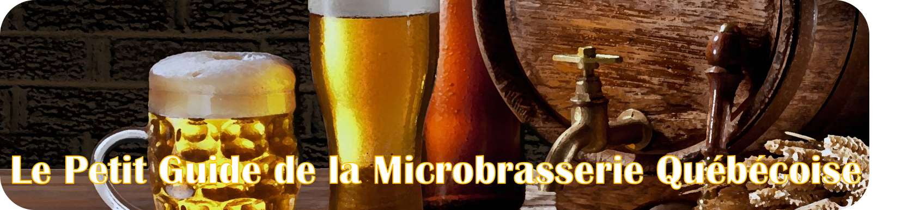
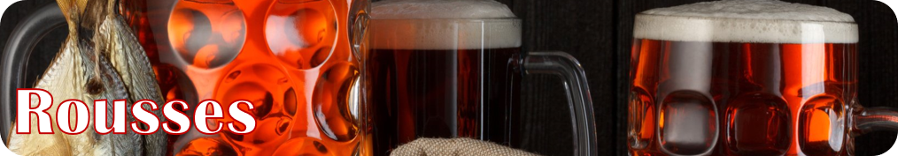
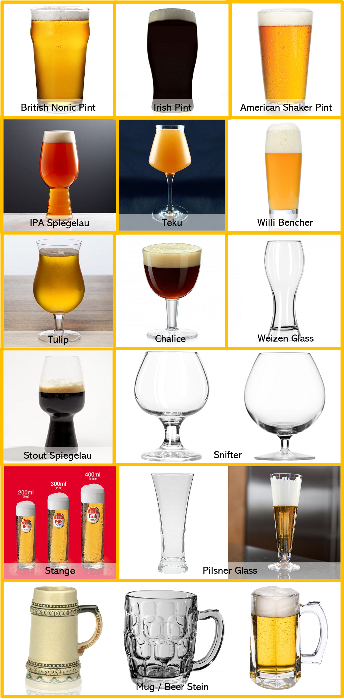

**Quelques infos:**

Je ne cherche pas à faire de pub en faisant ce guide.
Je ne suis pas payé pour faire ce petit guide, je le fais pour le plaisir!
Mon but est de partager mon expérience avec la bière pour initier de futurs amateurs de bière!
Toutes les informations que vous allez trouver dans ce guide ont été prises par mes nombreuses recherches sur le sujet, mes expériences, mes discussions, etc. Rien n’est techniquement officiel!
Ceci est une première version! Je vais l'update selon mes nouvelles découvertes :) Merci à mon ami Alex qui m'a donné pas mal de conseils avec les styles que je connaissais moins et à ceux qui m'ont aidé dans mon post sur Facebook!

Je vous conseille de regarder les profils de goûts sur [Untappd](https://play.google.com/store/apps/details?id=com.untappdllc.app&hl=en&gl=US). C'est un très bon site, très complet et fiable!

**Dans quel ordre boire?**

Vous avez différents choix: du moins au plus amer, de la plus pâle au plus foncée, de la moins forte en alcool à la plus forte... Moi personnellement j'y vais par taux d'alcool à une exception: si j'ai une Pastry Stout je vais toujours la boire en dernier.

**Table de matières:**

* Guide des styles par couleur + exemples + profil de goût
* Quel verre choisir?
* 24-pack pour débuter
* 24-pack pour aller plus loin
* Produits rares et échanges
* Brassage amateur À VENIR
* Contact

Cheers!

---

### Pilsner Czech
---
**Louvain @Silo**

Céréales,
malt,
caramel,
légère

**Pilsner Czech @L'Hermite**

Céréales,
citron,
florale,
herbacée,
amertume modérée

### Pale
---
**Pivo Červený @L'Amère à Boire**

Céréales,
herbacée,
malt,
caramel,
amère (leur **Černá** est moins amère)

### Kölsch, blonde allemande
---
**Saint-Laurent @Silo**

**Sentinelle @Dieu du Ciel**

**Monsieur Madame @Ras L'Bock**

Céréales,
malt,
un peu floral,
un peu de miel,
effervescente,
rafraîchissante,
légère

### Světlý Výčepní, pilsner tchèque
---
**Světlý Výčepní 10⁰ @Isle de Garde**

La meilleure pilsner toute comprise à mon avis: 0 amère, beaucoup de céréales, gros goût présent qui reste en bouche longtemps! Se procure uniquement chez Îsle de Garde pendant l'été.

**Coup de Foudre - Výčepní @Les Grands Bois**

(est une très bonne interprétation aussi)

Céréales,
texture cripsy,
rafraichissante,
légère

### Helles, lager allemande

(la différence entre les autres Lagers allemandes est plus sur l'histoire que sur le goût)

---
**Coup de Foudre - Helles @Les Grands Bois**

Céréales,
florale,
légère

---

### American Red Ale, rousse américaine
---
**La Bonne Aventure @Pit Caribou**

Caramel,
cassonade,
malt rôti,
légère amertume,
légère

### Irish Red Ale, rousse irlandaise
---
**Gros Pin @La Souche**

Caramel,
malt rôti,
un peu de noisettes,
un peu terreux,
peu amère,
sèche,
très légère: le goût est pas mal subtil

### Altbier, rousse allemande
---
**Fleury @Silo (ma rousse préférée!)**

Caramel,
malt,
pain grillé,
amère,
légère

### Rye, bière de seigle
---
(J'ai goûté uniquement celle de @Brewskey, mais elle est difficilement accessible. En général j'imagine que ça goûte pas mal pareil les Rye Amber/Rye IPA)
Il y a aussi Fashion Victim @Les Grands Bois qui a l'air pas pire.

Seigle grillé,
carmel,
fumée,
*houblonnée si IPA*,
texture crispy,
smooth

---

### Pale Ale
---
Si vous n'aimez pas beaucoup les bières fortes ou vous avez peur de l'amertume, ce serait une bonne idée de vous initier aux IPA en goûtant des bonnes Pale Ale! Je sais que @Brewskey et @Boréale en font des très bonnes, mais je n'ai jamais eu la chance de les goûter.

---

Par expérience, les IPA des brasseries les plus "populaires" sont difficiles à trouver (Sir John serait la plus accessible) donc je vais vous proposer d'autres IPA d'autres brasseries qui sont aussi très bonnes :D Let's go! 

---
Je commence avec des IPA très fruitées, peu résineuses, peu piney et peu amères:
---

**Ukulele (HBC 644 & HBC 342) @Lagabière**

Houblonnée,
fruits tropicaux,
agrumes,
texture juicy et hazy

**Double Descente @Boréale**

**IPA du Nord-Est @Boréale**

Très houblonnée,
fruits tropicaux,
agrumes,
zesty,
texture juicy et hazy (*la Double Descente est un peu plus liquide*),
*La Double Descente a une amertume modérée, la Nord-Est une faible amertume*

**Catnip @Noctem**

**Double Catnip de @Noctem**

**Tête de Pioche @Prosprecteur**

**Réverbère #2 @Brasserie Générale**

**Double Fruit Punch @Vox Populi**

**Etc.**

---
Dans une autre corde de goûts. Personnellement je l'aime moins, mais il faut lui donner une chance!
---

**Moralité @Dieu du Ciel**

Agrumes,
résineux,
pamplemousse,
amère,
sèche

**Ta Meilleure @Lagabière**

Fruitée,
floral / herbeux,
houblonnée,
amère

**West Coast IPA @Mille Îles**

**IPA de la Côte Ouest @Knowlton Co.**

Houblonnée,
agrumes,
fruits tropicaux,
amertume tranchante

---
Un excellent mix des deux palettes:
---

**Métamorphe @Le Castor**

**Lutine de @Le Castor**

Très houblonnée,
fruits tropicaux,
agrumes,
texture juicy, veloutée et hazy,
résineuse,
amère.
*Pourrait être une initiation au goût résineux si vous n'aimez pas ça*

---

IPA Américaine/DIPA/TIPA/Quadruple IPA/NEIPA (les bières Américaines sont souvent plus fortes en alcool, ont plus de goûts prononcés, plus d'amertume... Plus de tout ahahaha. Les Double IPA, Triple IPA... EN GROS, plus on ajoute un gros chiffre plus c'est fort en alcool. Les NEIPA sont des IPA moins amères et beaucoup plus houblonnées et aux goûts d'agrumes prononcés, excellentes pour s'initier!)

Les IPA de la Côte Ouest et les IPA Américaine sont des IPA axées sur les goûts résineux et piney. Souvent amères et pas très fruitées.

Il y a des IPA sûres, IPA au Gingembre, IPA noires, IPA blanches, Milkshake IPA, IPA de toutes les sortes! Je ne peux pas toutes les aborder :P, mais en voici quand même quelques-unes:

### IPA White
---
**Juteuse @Ras L'Bock**

Houblonnée,
agrumes,
texture juicy,
blé,
floral / herbeux,
levures belges,
amère

### Milkshake IPA, IPAs aux goûts de lactose et de vanille prononcés
---
**Los Tabarnacos @Brasserie du Bas-Canada**

(assez difficile à trouver et pas toujours en magasin, mais je trouve que ce sont les meilleures du style!)

**Milkshake @Le BockAle**

**Watatawow @Ras L'Bock**

Lactose,
vanille,
houblonnée,
très peu/pas amère,
souvent assez liquides/légères

### IPA Sour
---
**N'importe quelle Fructis Mortis de @Messorem Bracitorium**

(*c'est très difficile à se procurer si on ne va pas sur place, et ils ne vendent que des 4-pack. Mais c'est définitivement la meilleure du style*)

**Banjo @Jukebox**

Houblonnée,
ananas et tangerine (ou d'autres pour les Fructis Mortis que vous trouverez),
sûre,
un peu acide,
rafraîchissante,
texture légère

### IPA Brut
---
**IPA Sucée Extra Brut @MonsRegius**

Fruitée,
un petit peu piney,
agrumes,
effervescente,
très sèche,
douce amertume

---

## Brunes

### American/Brittish Brown Ale
---
**Castelnau @Dieu du Ciel**

**Hazel @Vox Populi**

Noix,
céréales rôties,
cendres,
café,
malt,
caramel,
amères,
texture crispy

### Barleywine/Vin d'orge
---
**Solstice d'hiver @Dieu du Ciel**

**Monarque - Vin d'orge obscur @8e Péché**

Céréales rôties,
dark,
caramel,
alcool fort,
amère.
*La **Monarque** a un goût de chocolat/cacao en plus, ça pourrait être une bonne initiation à ce style*

---

## Noires
---
### Imperial Stout
---
**Péché Mortel @Dieu du Ciel**

Café,
céréales rôties,
torréfaction,
dark,
amère,
texture crémeuse

**Impériale Scotch @Beauregard**

(leurs autres bières affinées en fût de quelque chose sont très bonnes aussi!)

Chocolat,
noisette,
dark,
scotch (*bonne initiation au goût de Whisky/Scotch/Bourbon*),
un peu le café,
amère, mais le chocolat l'adoucit un peu,
texture crémeuse

**Nocturna Affogato @MonsRegius**

Chocolat,
vanille,
cacao,
café,
lait 1%,
amère,
texture liquide (*pourrait être une initiation aux Pastry Stout si vous n'aimez pas la texture crémeuse*)

**Russe Impériale Stout @Vrooden**

Chocolat,
bourbon,
café,
vanille,
texture crémeuse.
*Si vous n'aimez pas le gros goût de sucre/dessert, ça pourrait être un bon pont vers les Pastry Stout*

---

Il y a énormément de différences entre les Imperial Stout: ajout de fruits, noix de coco, vanille, café, piments, alcool fort, bois... Je ne peux pas toutes les aborder! 

---

### Pastry Stout
---
**Déliquescence @8e Péché**

Chocolat,
noix,
noisettes,
vanille,
lactose,
texture très crémeuse (du *Nutella* en cannette)

**Impériale Choco-Café avec amandes @Beauregard**

Chocolat,
amandes grillées,
café,
cacao,
vanille,
lactose,
texture crémeuse

**N'importe laquelle de @Brewskey. Si vous avez la chance de vous en procurer une! C'est très sucré et jamais barrique en général.**

### Porter Baltique
---
**Porter Baltique @Beauregard**

Chocolat,
vanille,
amandes grillées,
lactose,
texture crémeuse.
*En gros, une Pastry Stout moins intense dans les goûts. On pourrait comparer ça avec des Pale Ale et des IPA... mettons*

**La Gayo @Les Insulaires**

Café en masse!,
cendres,
tabac,
vanille,
un peu de piment fort

**Porter Baltique @LTM**

Café,
cigare,
vanille,
fumée.
*Pourrait être une initiation aux Stout bien dark et pas chocolatées comme la Péché Mortel régulier*

### White Stout
---
**Stout Blanc @Oshlag**

Café,
vanille,
lait,
chocolat au lait,
robe dorée.
*Une Stout n'est pas nécessairement une bière noire. Techniquement le mot Stout fait [historiquement] référence aux bières fortes en alcool. On dirait un café glacé!*

### Stout avec piments forts
---
**Impériale Choco-Piment Chipotle (ou Chili) @Beauregard

Chocolat,
sucrée,
pimentée,
crémeuse.
*Ça chauffe!*

### Stout aux arachides
---
**Stout aux Arrachides @Beauregard**

Arachides en masse (au nez, pas vraiment au goût),
notes de torréfaction,
un peu de chocolat,
un peu dark,
texture assez liquide

---

## Sûres/Acides/Fruitées

### Smoothie Beer
---
Fruitée, sucrée, lactose, goûte Vraiment le fruit que c'est sensé goûter, 0 amère, un peu sûre, pas acide, incroyable texture de smoothie, mottons présents (en petite quantité). N'importe quelle BrewJuice, BrewCake ou Cobbler de @Brewskey, Petit Jus de Mort de @Messorem Bracitorium, Smoothie aux QQCH des @Insulaires et Gros Jus de @La Centrale.

### Fruit Beer
---
Texture entre légère et smoothie, pas de mottons, gros goût de fruits, un peu sûre/acidulée, 0 amère. Megafruits Raptor de @La Barberie, Mango Jelly @OverHop, etc.

### Berliner Weisse
---
Texture légère, pas de mottons, goût de fruits assez subtil, rafraîchissante, 0 amère, sûre et acidulée. N'importe quelle Rocket de @L'Octant, n'importe quelle Solstice d'Été de @Dieu du Ciel, Limoilou Beach de @La Souche (plus acide)... Une autre intéressante est Silo F de @Silo, elle goûte la goyave! Rares sont les bières à la goyave!

Je trouve que les Fruit Beer et Berliner Weisse sont souvent mélangés. Je pense qu'une Berliner Weisse est plus acide, sûre et légère, tandis qu'un Fruit Beer a des goûts fruités pas mal plus prononcés et une texture un petit peu plus crispy. Pour la Smoothie Beer c'est sa texture qui la caractérise en plus de son acidité négligeable.)

Il y a énormément de différences entre les bières sûres : leur texture, leur goût, les ingrédients utilisés, leur acidité, l'utilisation du bois ou non... Je ne peux pas toutes les aborder! Voici d'autres styles aussi sûrs:

### Gueuze
---
**Ceci n'est pas une Gueuze @LTM**

Pomme verte surette,
citron,
acidulée.
*D'habitude les Gueuzes coûtent très cher à la SAQ (vous pouvez trouver des 375mL à 20$... peut-être même 30$) - la France et la Belgique font les meilleures, celle-ci est une très bonne interprétation abordable!*

### Flander's Red Ale
---
**Cuvée des Jacobins Rouge @Omer Vander Ghinste (SAQ)**

Fruitée,
pommes,
cerises,
très sûre,
acidulée.
*Bonne initiation à la bière pour les amateurs de vin rouge.*

**Rouge de Mékinac @À la Fût**

Fruitée de griottes,
vineuse,
boisée,
acidulée

### Gose
---
**La Marine @Insulaires**

**La Calaca @Noctem**

Salée,
coriandre,
citron,
rafraîchissante

### Lambic Framboise
---
**Framboise @Lindemans (SAQ)**

Très sucrée,
gros goût de framboises,
sûre

---

## Autres

### Tripel/Triple Belge
---
**Triple Karmeliet @Bosteels (SAQ) (*la Tripel classique d'Europe!*)**

**Dominus Vobiscum Triple @Charlevoix**

**La Fin du Monde @Unibroue**

**Triple Belge aux Poires @Mille Îles ( un gros goût de poire vient s'ajouter)**

**Anna @Vox Populi (belle transition de IPA vers les bières belges. Celle-ci est pas mal houblonnée)**

Levures belges,
banane,
douce,
sucrée

### Belgian Golden Ale/Blonde belge
---
**Flacatoune @Charlevoix**

### Belgian Golden Strong Ale

**Delerium Tremens @Huyghe (IGA)**

Levures belges,
un peu la poire,
un peu la banane,
*peu goûter l'alcool et un peu pétillante (si Strong), mais reste doux en bouche*

### Witbier/Blanche
---
**Hoegaarden @Hoegarden**

**Blanche de Chambly @Unibroue**

**La 475 Blanche de Pattro @Pit Caribou**

Fruitée,
pelure d'orange,
graines de coriandre,
*épices, selon les recettes*,
des fois ça goûte un peu la banane,
légère,
douce

### Witbier/Blanche, je ne lui aurais pas donné ce style par contre... peut-être plus Saison
---
**Tourbière Sûre @La Souche**

Pommettes sûres,
rhubarbe,
pomme verte,
thé,
très subtile,
pétillante,
légère

### Gruit/Ancient Herbed Beer
---
**Bière de Gazebo @L'Espace Public**

Citron,
gingembre,
herbacée,
cannelle,
pomme verte surette,
un peu l'anis,
un peu le romarin

### Spiced Beer
---
**Sang de Lutin @Brouhaha (la seule du style que j'ai goûtée)**

Florale,
fruitée,
épicée: cannelle, poivre, romarin

### Yam Beer/Pumpkin
---
**Ale-Ô-Ween @Treffle Noir (la seule du style que j'ai goûtée)**

Citrouille,
épices: clou de girofle, cannelle,
douce,
légère

### Best Bitter
---
**5 - Best Bitter @Harricana**

Caramel,
malt,
légère,
amertume faible/modérée.
*Ressemble à une lager rousse avec un goût un peu plus prononcé*

### Steinbier
---
**Voivoid Lost Machine @Hopfenstark (la seule du style que j'ai trouvée, il doit y en avoir d'autres?)**

Caramel (*à cause des roches ajoutées pendant le mash (la cuisson des grains)*),
malt,
sucrée,
peu houblonnée

---

## À venir (il y a d'autres styles, mais je ne les aborderai pas):

Adambier: *celle de @Vox Populi*

American Wild Ale: *Colorado de @Castor*

Belgian Dubbel: *je pensais goûter la Dubbel*

Black IPA

Bock - Doppelbock (il y en a d'autres, j'ai décidé d'essayer le Doppelbock): *celle de @LTM*

Cream Ale: *celle de @Knowlton Co.*

Dark Lager: *celle de @LTM*

Farmhouse brettée: *Saison Brett de @LTM*

Flanders Oud Bruin: *Lapsus de @Benelux*

Grisette: *n'importe laquelle de @Dunham*

Hefeweizen: *n'importe laquelle à la SAQ*

India Pale Lager

IPA Brut

Kellerbier/ Zwickelbier: *celle de @Vrooden*

Lambic Kriek

Märzen: *celle de @Vrooden

Old Ale: *Ol' Keeper de @Castor*

Rauchbier: *celle de @Vrooden*

Saison: *Saison des Plages de @Boréale*

Scotch Ale/Wee Heavy: *Corne de Glace de @À l'abri de la Tempête*

Wheat Ale: *Ale de blé américaine de @Knowlton Co.*

Winter Warmer ou Winter Ale: *Réserve de Noël de @LTM*

---

# Verres

Pour les meilleurs verres à utiliser pour chaque style je vous conseille de vous baser sur ce guide-ci, je le trouve excellent:

https://justbeerapp.com/article/glassware-guide-which-beer-styles-should-be-served-in-what-glass

**Où les acheter?**

Normalement les verres se vendent à 8$---20$ dans les détaillants de bière ou les brasseries. Il y a aussi des magasins qui en vendent, par exemple [Vinum](https://vinumdesign.com). Personnellement, je suis allé chez *Renaissance* et j'ai tout acheté là! C'est 0.50$ le verre à peu près, et vous pourriez trouver des petits bijoux! Il y a aussi des groupes de trade sur Facebook: [Collectionneurs De Verres De Bière Du Québec](https://www.facebook.com/groups/1696716747102786), [Echange Verre de Bière du Québec](https://www.facebook.com/groups/1598609583741693).

Si vous ne voulez pas dépenser beaucoup, je vous conseille d'y aller simplement: achetez-vous un Teku et mettez tout ce que vous buvez dedans!

**Si vous voulez y aller un petit peu plus loin, voici les 4 verres à avoir à mon avis:**

1x Pilsner pour n'importe quelle Lager Blonde et les Gose

1x Nonic Pint pour vos Rousses, Brunes et Stout régulières

1x Tulip pour vos sûres

1x Teku pour les IPA, les Stouts de dégustation et tous les autres styles dont vous n’avez pas le bon verre

**Si vous voulez avoir pas mal tous les verres :P, voici les verres à avoir (basez-vous sur le site web plus haut pour savoir lequel utiliser):**

*note: normalement les Kölsh se boivent dans des Stange de 200mL et les Altbier dans ceux de 300mL ou 400mL.*

---

# 24-pack essentiel - pour la 24e ajoutez quelque chose que vous avez aimé que vous vouliez découvrir avec une autre brasserie!

Voici les styles et les goûts que je vous propose pour votre 24-pack :) je vous laisse le magasiner selon le guide ci-haut! J'ai pas encore tout écrit dans le guide donc ça se peut que vous n'ayez pas de répères pour certains styles :O fiez-vous aux styles que je dois encore essayer dans ce cas-là!

| Lager Blondes | Rousses | IPAs | Brunes | Noires | Sûres | Autres |
| :-- | :--: | :--: |  :--: |  :--: | :--: |  --: |
| Lager Blonde (amère ou non, l'autre dans l'autre 24-pack)  | Rousse | IPA fruitée, 0 amère et 0 résineuse | Brown Ale | Stout Dark | Smoothie Beer | Belgian Strong Golden Ale |
||| IPA résineuse | Doppelbock | Pastry Stout crémeuse | Fruit beer | Witbier/Blanche |
||| Milkshake IPA | Scotch Ale/Wee Heavy | Stout Blanche | Berliner Weisse | Gruit ou Spiced Beer |
|||||| Gose | Hefeweizen |
|||||| Gueuze | Farmhouse brett |
||||||| American Wild Ale |
||||||| Winter Warmer |

# 22-pack pour aller plus loin - pour les 2 autres ajoutez quelque chose que vous avez aimé que vous vouliez découvrir avec une autre brasserie!

| Lager Blondes | Rousses | IPAs | Brunes | Noires | Sûres | Autres |
| :-- | :--: | :--: |  :--: |  :--: | :--: |  --: |
| Lager Blonde (amère ou non, l'autre dans l'autre 24-pack) | Rye Amber | IPA Brut | Best Bitter | Impériale Choco-Piment Chipotle @Beauregard | Une Berliner Weisse ou une Smoothie avec un autre fruit |  Une bière au gingembre |
|||| Barleywine | Stout à l'arachide @Beauregard | Silo F @Silo | Une bière à la citrouille |
|||| Belgian Dubbel ou Quadruple Belge || Lambic Framboise ou Kriek | Tourbière Sûre @La Souche |
|||| Smoked Beer || Cidre | Wheat Beer |
|||||| Flander's Red Ale | Kellerbier/Zwickelbier |
||||||| Tripel aux Poires @Mille Îles |
||||||| Märzen |
||||||| Farmhouse Saison |
||||||||
||||||||

---

# Produits rares et échanges

Plusieurs produits sont rares lorsque vous les cherchez à l'extérieur de certaines régions. Par exemple, du Brewskey se vend uniquement à Montréal, du Sir John se vend à Lachute et des fois à Montréal (je ne sais pas si ailleurs), etc. je vais vous mettre dans ce guide plusieurs bières au cas où vous ne trouviez pas tous les produits dans votre région! Moi j'habite Montréal donc je ne sais pas exactement qu'est-ce qui se vend ailleurs.

Je vous conseille de suivre les nouvelles de vos détaillants de bière (les magasins), de vos brasseries préférées et de la SAQ pour savoir des nouveautés! Le groupe [Actualités du milieu brassicole Qc](www.facebook.com/groups/258612807916349) a beaucoup d'info!

**Bières importées**

La SAQ a beaucoup de bières importées. Suivez les nouveaux arrivages de près, des fois vous pouvez trouver des Gueuzes et Lambic de France ou Belgique de grandes brasseries (comme Cantillon).

Il y a d'autres places où trouver des bières importées (sachez que ça coûte assez cher!), entre autres: [Importation Pivo](https://www.facebook.com/importationpivot), [Îsle de Garde](https://www.isledegarde.com/bieres-importees), etc.

Ça s'échange pas mal bien aussi ces bières-là!

**Quels styles sont rares? Quelles brasseries sont rares/échangeables?**

En général un produit est échangeable s'il est limité et si la brasserie est populaire/reputée. Il y a des brasseries qui ne livrent pas leurs produits aux détaillants (donc vente sur place), ces produits sont aussi rares!

**Voici une liste de brasseries qui s'échangent très bien:**

Brewskey

Messorem Bracitorium

Sir John (principalement celles qui ne sont pas/plus chez les détaillants)

Bas-Canada

Wood Brothers

Bellwoods

Robin

**Auval**

etc.

**Voici une liste de brasseries qui s'échangent bien s'ils ont des produits spéciaux:**

Beauregard

Dieu du Ciel

Avant-Garde

LTM

etc.

**Il y a d'autres brasseries moins connues qui ont de très bons produits, mais qui sont vendus uniquement sur place, peut-être eux aussi seraient échangeables? J'en connais juste deux:**

Îsle de Garde

La Centrale

**Où échanger?**

Il y a plusieurs groupes où vous pouvez échanger vos bières. Mon préféré est [Bazaar Bière](https://www.facebook.com/groups/1529571330607267/). *Note: FT veut dire For Trade, ISO veut dire In Search Of*.

Si vous ne pouvez pas aller chez Messorem (ou vous ne voulez pas acheter leur 4-pack, vous avez ce groupe-ci: [Messorem Bracitorium Enthusiasts](https://www.facebook.com/groups/583611702281464/).

Si jamais vous cherchez du Auval vous avez: [Spotted Auval](https://www.facebook.com/groups/2126136684156698/).

Il doit y en avoir d'autres, mais je ne les connais pas!

Voici un groupe pour connaître la valeur secondaire de vos bières (dans le cas où vous vouliez les échanger et vous ne saviez pas si le ratio est le bon): [VSBQ](https://www.facebook.com/groups/301037520961589).

# Brassage amateur À VENIR

[Nanobrasseur](https://www.facebook.com/groups/nanobrasseur/)

[Bazar du brasseur](https://www.facebook.com/groups/808588615953404/)

# Contact

