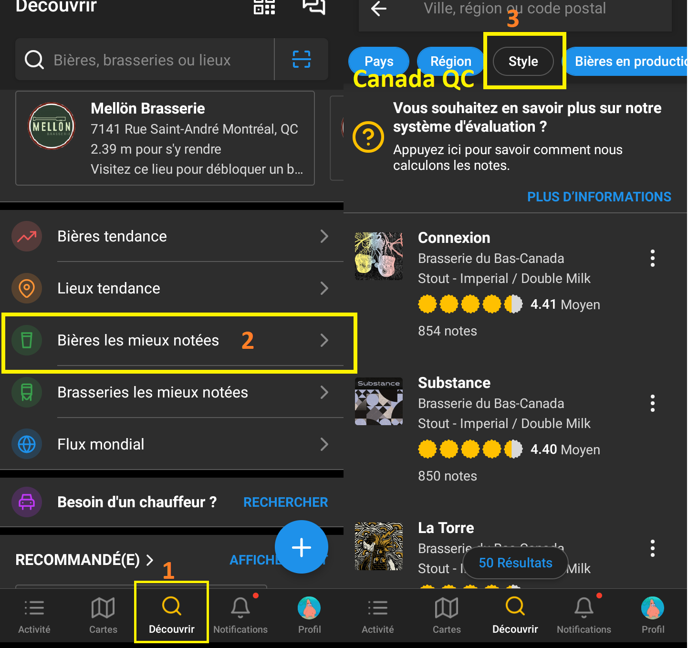

D'autres styles ne seront pas abordés, mais vous pouvez les rechercher par vous-même.

* Belgian Enker/Patersbier
* Bière de Coupage
* Bière de Garde
* Bière de Mars
* Black and Tan
* California Common
* Chicha de Jora
* Chilli Beer
* Dampfbier
* Dunkelweizen
* Eisbock
* Freeze-Distilled Beer
* Hard Ginger Beer
* Honey Beer
* Hopfelweisse
* Kentucky Common
* Koji/Ginjo Beer
* Kristallweizen
* Kvass
* Lager Dortmunder
* Lambic Faro
* Lichtenhainer
* Mumme
* Roggenbier
* Shandy/Radler
* Smoked Beer
* Winter Ale
* Winter Lager
* Zoigl
* toutes les sortes de Mead
* toutes les sortes de Mild
* etc.
