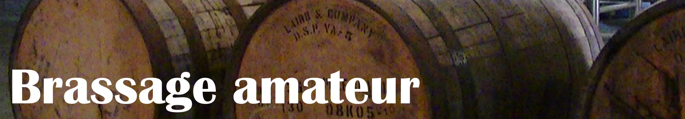

# Brassage amateur EN CONSTRUCTION

## Matériel

Je vous propose ci-dessous une liste de matériel de base pour que vous ne dépensiez pas plus que **200$** pour votre première brassée ! Vous avez peut-être même déjà du matériel chez vous, qui sait :) Vous pouvez certainement augmenter votre budget en achetant des machines qui font tout à votre place comme le Grainfather, ou en achetant des bonus comme un refroidisseur, mais mon but est de vous initier à ce domaine sans que ça vous coûte trop cher.

Je vous recommande de demander dans <a href="https://www.facebook.com/groups/nanobrasseur/" target="_blank">Nanobrasseur</a> c'est où le magasin de brassage le plus proche de chez vous. Ensuite, mettez-vous en contact avec ce magasin et demandez-leur de vous sortir le matériel qu'il vous manque dans cette liste:

### Chez votre magasin de brassage (autour de 115$ avec taxes)

Tous mes prix sont basés sur <a href="https://www.moutinternational.com" target="_blank">Moût International</a> en janvier 2022.

* une tourie en verre de 1 gallon (5.75$)
  * c'est bien d'en avoir 2 si vous voulez faire plus qu'une batch par mois, ou si vous voulez expérimenter différents ajouts en dry hop (par exemple vous brassez une Ale et vous séparez le tout dans les deux touries. Ensuite, vous ajoutez des framboisez à la tourie A et des fraises à la tourie B pour essayer deux ajouts différents)
* un bouchon (1.35$)
* un barboteur/bonde aseptique (1.30$)
  * pensez à en avoir un en backup au cas où le vôtre brise
* un sac de brassage BIAB (18$)
* un autosiphon (le 3/8" c'est 9.55$)
* un remplisseur bout noir (le 3/8" c'est 3.30$)
* un capsuleur (16.75$)
* des capsules (250g c'est 4.10$)
* un thermomètre (6$)
  * pensez peut-être à en avoir un deuxième pour le chaudron du rinçage
* une brosse en L (7.80$)
* du Star San (80oz c'est 15$)
* du PBW (500g c'est 10$)

### D'autres outils importants (autour de 83$ avec taxes)

* une marmite de 15L au minimum (<a href="https://www.canadiantire.ca/fr/pdp/marmite-h2k-en-acier-inoxydable-18-10-allant-au-lave-vaisselle-et-au-four-0423620p.html#srp" target="_blank">45$</a> par exemple)
* une balance numérique (autour de 25$ sur Amazon)
* un push-push (2$)
* un tamis
* un fourquet
  * une cuillère en bois de brassage, mais une régulière marche aussi
* un gros entonnoir solide
  * moi je n’en ai pas, j'utilise le petit que j'ai dans ma cuisine, mais il faudrait que je m'en achète un plus gros, et en plastique haha
* des bouteilles de bière qui marchent avec vos capsules

### Matériel optionnel

#### disponibles à votre magasin de brassage

* quelques cotons-fromage (1.10$ chaque)
  * genre 3 (peut-être plus ? Après 4-5 brassées ils ne marchent plus très bien, mais moi je ne les utilise même pas)
* un densimètre (10$)
* un cylindre gradué pour mettre le densimètre (4$)
* irish moss (200g c'est 1$)
* du dextrose (500g c'est 2.80$)
* chlorure de calcium (50g c'est 1$)
* acide lactique 88% (70mL c'est 4.30$)
* gypse (50g c'est 1$)
* sel d'Epsom (50g c'est 1$)
* du sel de table (je suis sûr que vous avez déjà ça)

#### et les autres

* une casserole d'au moins 8L
* une pipette graduée pour l'acide lactique
* un erlenmeyer
* de l'iode
* de la neige ou de la glace

### Matériel bonus

Je n'ai pas ce matériel, mais ça pourrait être un bel ajout:

* un refroidisseur
  * demandez sur Nanobrasseur pour voir si vous pouvez l'acheter usagé !
* une tour à bouteilles (23$)

## Commençons...

Je ne vais pas m'approfondir dans la théorie; je ne cherche pas à vous faire perdre votre temps. Mon but est que vous puissiez faire votre première brassée ASAP, et si vous avez eu votre piqure que vous recherchiez plus d'informations par la suite. Je vais principalement aborder les grosses lignes et vous donner plusieurs trucs.

### Étape 0: calculer le profil d'eau

Le profil d'eau décrit la chimie de l'eau nécessaire pour la brassée: son pH et ses composants.

Normalement, quand vous achetez une bouteille d'eau, vous avez une étiquette du genre:

*note: assurez-vous d'avoir le pH, ce n’est pas toujours indiqué. Si c'est votre cas, vous devrez contacter la compagnie d'eau.*

Pour faire une recette de bière, vous devez utiliser un profil d'eau selon le style de bière que vous faites (faites une recherche sur Internet ou demandez dans des forums spécialisés pour savoir quel profil d'eau utiliser). Une fois vous avez votre profil d'eau visé, et votre profil d'eau initial, vous devez utiliser un calculateur pour voir quelles composantes vous devez ajouter à votre eau. J'en ai essayé plusieurs sur Internet, mais celui qui m'a semblé le plus facile est <a href="https://brewfather.app/" target="_blank">Brewfather</a> (aussi disponible chez <a href="https://play.google.com/store/apps/details?id=com.warpkode.brewfather&hl=en_US&gl=US" target="_blank">Google Play</a> et <a href="https://apps.apple.com/us/app/brewfather/id1488585822" target="_blank">Appstore</a>).

#### Eau 💧

Je vous conseille de ne pas utiliser l'eau du robinet directement sauf si vous utilisez un filtre. Je recommande fortement l'utilisation de bouteilles d'eau pour éviter d'introduire du chlore dans la bière. Finalement, n'utilisez pas de l'eau distillée ni déminéralisée: les levures n'auront aucun minéral pour se nourrir.

### Étape 1: empâtage 🌾

L'empâtage est la première étape du brassage. Le but est de faire sortir les sucres des grains pour qu'ils restent dans l'eau.

Cette étape peut se faire de plusieurs façons, je vais vous en proposer deux:

#### Façon 1 (plus simple et le résultat est le même)

    Mash-in:
        Chauffer l'eau jusqu'à 50°C.
        Ajouter les grains.
        Chauffer jusqu'à 67°C-68°C, maintenir durant 60min.

    Mash-out:
        Chauffer jusqu'à 77°C-78°C (faire attention de ne pas dépasser 80°C, au besoin aller à 76°C pour être *safe*), maintenir durant 10min.

#### Façon 2

    Mash-in:
        Chauffer l'eau jusqu'à 50°C.
        Ajouter les grains.
        Chauffer entre 63°C et 65°C, maintenir durant 30min.
        Chauffer entre 68°C et 75°C, maintenir durant 30min.

    Mash-out:
        Chauffer jusqu'à 77°C ou 78°C, maintenir durant 10min.

Premièrement, vous remplissez deux chaudrons d'eau selon les quantités nécessaires: l'un pour le mash et l’autre pour le rinçage. *Optionnellement*, vous ajustez le profil de l'eau des deux chaudrons.

Vous suivez ensuite l'une de deux *façons* proposées ci-haut.

*Optionnellement*, avant le mash out, faites un test d'iode (expliqué ci-dessous) pour vérifier que le mash a terminé.

Je vous conseille d'utiliser le **feu bas** en tout temps ! Utilisez le couvercle pour maintenir la température, et au besoin, tassez, remettez, retassez... du feu... Si la température diminue, placez la marmite sur le feu, puis allumez le rond autour d'une minute, ensuite ôtez-la.

Brassez du bas vers le haut avec une cuillère de brassage stérilisée (une cuillère de bois fait l'affaire).

Ne jamais dépasser 80°C !

Essayez de garder une température toujours **constante** lors des étapes !

#### Test d'iode

**Avant le mash out**, prenez une cuillère du maische (l'eau qui a reçu les sucres des grains) et ajoutez deux ou trois goûtes d'iode. Si ça tourne rouge/orange c'est parce que l'empâtage est terminé. Si c'est violet/bleu c'est parce qu'il faut donner encore quelques minutes au mash in. Personnellement, j'oublie souvent de le faire ahaha.

#### Ratio eau/grains

Je n'ai pas vraiment de formule magique à vous donner, mais, mettons, si jamais vous brassez pour 1kg de grains, et que le houblonnage dure 60min, je mettrais 7.5L d'eau pendants le mash et 2.5L pour le rinçage.

Vous allez voir que c'est dur de trouver des calculateurs simples sur le web. Je vous conseille d'y aller au pif et d'apprendre de vos erreurs: notez toutes les quantités après chaque brassée (et ajoutez des commentaires) ! Surveillez aussi la quantité d'eau qu'il vous reste après le mash, si vous n'avez pas assez mis d'eau, essayez de ne pas mettre à feu trop fort votre houblonnage, ou faites 45min au lieu de 60min par exemple.

#### Recirculement

On ne le fait pas vu qu'on fait du BIAB.

#### Filtration et rinçage 🚿

Chauffer environ 1/3 d'eau du volume total à 78°C dans une autre casserole. Par exemple, si vous avez 7.5L d'eau pour le mash, vous devez chauffer 2.5L d'eau pour le rinçage.

Sortez le sac de brassage de la grosse marmite et le tenez la au-dessus de la cuvée.

Rincez le sac avec l'eau de rinçage que vous avez chauffée (ne pas rincer trop vite).

Vous **ne devez surtout pas** compresser les grains (ceci donnera un mauvais goût à la bière: ça ajoutera des tannins, ce goût astringent, présent dans le vin, qui touche l'intérieur des joues.)

### Étape 2: houblonnage

Portez le maische à ébullition pendant le temps que dit la recette: normalement, entre 60min et 120min.

Ajoutez les houblons comme le dit la recette. Par exemple, supposant que l'étape dure 60min, et qu'on doit ajouter le houblon A à 60min et le houblon B à 10min, ceci signifie qu'on ajoute A quand il reste 60min de temps et B quand il reste 10min au houblonnage.

*Optionnellement*, vous pouvez ajouter 1 c.c de Irish Moss à 10min.

Vous pouvez avoir un coton de fromage pour vos houblons. Ceci facilitera la mise en tourie: vous auriez moins de choses à filtrer avec le tamis. Moi personnellement je n'en utilise pas.

*note: une mousse de protéines se formera pendant cette étape, vous pouvez l'écumer avec une passoire.*

Ne mettez pas le couvercle et surtout: surveiller la quantité d'eau.

#### Whirlpool 🌪️

Certaines recettes demandent un *whirlpool*. Si c'est votre cas, à la fin de l'ébullition, fermez le feu et baissez la température à 60°C (140°F). Avec une cuillère en bois désinfectée, tournez énergiquement le moût durant 2 minutes. Laissez-le tourner durant 10 minutes.

Transvasez le moût dans un autre récipient à l'aide d'un autosiphon ou le robinet du chaudron tout en ne touchant pas le centre du tourbillon: le but est de laisser les résidus dans l'ancienne marmite.

### Étape 3: refroidissement 🥶

Vous devez atteindre la température d'activation de la levure (écrite sur le sachet) le plus rapidement possible ! En général, pour une fermentation basse c'est entre 21°C et 25°C et pour une fermentation haute entre 26°C et 30°C.

Personnellement, je bouche mon évier et j'y place de la neige (que je prends de dehors). Ensuite, j'arrose ma marmite constamment avec de l'eau froide. Quand je sens que l'eau n'est plus très froide, j'enlève le bouchon, je fais partir l'eau chaude, je remets le bouchon et je recommence... Je tourne lentement avec mon thermomètre pour ne pas fausser ma température (mais je ne le fais pas trop fort pour éviter d'oxygéner ma bière: des bactéries **pourraient** se placer dans le moût).

*optionnel: remplis 1L du moût pour le levain (serviront à activer de futures levures de futures brassées. Le but est d'habituer les levures à l'environnement où elles devront travailler), se conserve quelques jours au frais ou se congèle.*

Placez une passoire au-dessus de votre fermenteur et transvidez le contenu de la marmite (vous pouvez mettre un entonnoir sous la passoire pour vous aider): attention de ne pas prendre les résidus dans le fond ! N'ayez pas peur d'oxygéner votre bière: les levures veulent avoir de l'O2 pour survivre !

Remplissez la moitié du barboteur d'un mélange d'eau et de Star San ou de Vodka.

### Étape 4: levurage

Mesurez la densité avant le levurage avec un densimètre: personnellement je ne me casse jamais la tête et je ne le fais pas haha.

11g à 15g de levure sèche suffit pour 20L de bière, après vous faites une règle de trois. Si jamais vous brassez une bière qui a beaucoup de grains, vous devriez peut-être utiliser le double de levures, mais ça devrait être écrit dans la recette.

En guise de repère, je mets 1/3 du sachet de levures dans mes 1 gal.

Si la levure est sèche il faut la réhydrater (avec un starter), mais, entre vous et mois... ce n’est pas si grave sinon :P Mettez 1/2 du sachet si vous ne le faites pas.

Si la levure est liquide, il faudra l'activer (vu qu'il y a moins de micro-organismes). C'est écrit dans le sachet comment faire.

Pour ne pas causer de choc thermique avec les levures: mettez les levures à température pièce avant de la mettre (sortez-la du frigo au **début** du brassage) dans le fermenteur.

#### Réhydratation

Bien lire les instructions dans le sachet des levures. Certains sacs vous diront de faire une réhydratation. Pour le faire, faites bouillir 10x le volume des levures d'eau durant 15 minutes et versez-le dans un récipient (souvent un erlenmeyer) stérilisé. Laisser refroidir l'eau jusqu'à la bonne température: fermentation basse entre 21°C et 25°C, fermentation haute entre 26°C et 30°C. Ensuite, diluez les levures dans ce mélange, remuez bien, et laissez-les se dissoudre pendant 30 minutes.

#### Levain/Starter

À faire le matin ou la veille du brassage. Placez 2 doses d'eau (ou un ancien moût) pour une demi-dose de sucre ou de malt. Ensuite, mettez vos levures dedans pour qu'elles soient prêtes pour le travail !

### Étape 5: fermentation

#### Primaire

Placez le fermenteur dans un endroit sombre entre 18°C et 25°C pour une ale (fermentation haute), et 10°C et 15°C pour fermentation lager (fermentation basse).

#### Kraüsen

N'ouvrez pas le fermenteur pendant le kraüsen (mousse brunâtre) sauf s'il y a des ajouts à faire. Cette étape dure de 5 à 7 jours.

#### Comment savoir si la fermentation fonctionne ?

Vous devriez avoir des petites bulles dans votre barboteur.

#### Secondaire

Il est préférable de transvaser le moût dans une seconde cuvée (**évitez de réoxygéner la bière**) afin que le dépôt de levures mortes et de résidus ne trouble pas le résultat final. Moi personnellement, je ne le fais pas.

Lorsque le barboteur ne bouge plus, faites un test de densité. 24h après, en refaire un autre. Si la densité est stable, passez au *cold crash* ou à l'embouteillage directement. Vu que je n'utilise pas de densimètre, je laisse la bière fermenter comme 3 à 5 jours de plus pour être sûr que la fermentation est bel et bien finie. Ça m'est déjà arrivé de la laisse plus qu'une semaine et le résultat était tout aussi bon !

*note: on peut aussi faire uniquement une primaire sur trois semaines au lieu d'en faire une primaire et une secondaire.*

#### Dry hop ou ajout de fruits/épices/...

À mettre pendant la fermentation active. Donc, pendant le high kraüsen (grosse mousse brunâtre, environ 2" d'épaisseur).

Stérilisez tous les ajouts avec votre push-push de Star San (1.6mL par 1L) ou avec de l'eau bouillante ou avec de la Vodka. Vous n'avez pas besoin de stériliser les houblons.

Laissez-les de 5 à 14 jours selon la recette. Idéalement, ne mettez pas ces ajouts dans un coton de fromage: évitons les bactéries.

#### Cold Crash / Mise à froid du houblon

Cette étape est optionnelle. Afin de clarifier la bière, mettre le fermenteur dans la pièce la plus froide possible sans le geler pendant 12h à 48h.

#### Sucrage

Vous devez ajouter du sucre pour déclencher la deuxième fermentation: celle-ci ajoutera les bulles à votre bière, sinon, elle sera flatte.

Les quantités sont à peu près de 5g à 8g de dextrose (ou de sucre blanc) par litre.

Délayez le sucre dans un bol d'eau bouillante, mettez-le dans le fermenteur. Finalement, brassez très lentement pour éviter d'oxygéner la bière. Personnellement, je filtre le contenu de mon fermenteur dans ma marmite de brassage. Ensuite, je dépose le sucre dans la marmite, je brasse lentement, et finalement j'utilise mon autosiphon pour remplir mes bouteilles.

### Étape 6: Embouteillage

**Tout laver et tout stériliser !**

Transvidez le contenu du fermenteur dans vos bouteilles sans trop oxygéner la bière. Idéalement, utilisez un autosiphon, placez-le au plus bas de chaque bouteille (pour éviter que la bière soit en contact avec l'oxygène) puis remplissez-les.

*conseil: mettez le fermenteur au-dessus des bouteilles pour faire couler la bière par gravité.*

#### Température ambiante / Prise de mousse

Gardez vos bières debout, à température ambiante (autour de 21°C) durant 14 à 21 jours dans une pièce sombre.

Goûtez à une bière après deux semaines, et attendez une semaine de plus pour que vous voyiez à quel point ce sera meilleur ! Après 3 semaines ça devrait être prêt à être bu !

#### Conservation

Les pils et les bières légères se gardent au plus 6 mois.

Les stouts ou les porters se gardent au plus 2 ans à une température entre 10°C et 12°C.

Les bières spéciales de type trappiste se gardent plusieurs décennies.

### Comment nettoyer

Nettoyez avec du PBW à l'eau chaude. Rincez à l'eau froide. Ensuite, mettez le Star San, ajoutez de l'eau froide et frottez. Finalement, vous n'avez qu'à égoutter votre matériel (**ne le rincez pas**).

*astuce: ayez un push-push avec du Star San dilué avec de l'eau. C'est super pratique !*

### Substituts

Si jamais vos grains, vos houblons ou vos levures ne sont pas en stock, demandez à votre magasin de brassage par quoi les remplacer (ou faites une recherche rapide sur Internet).

## Votre première brassée 🍺

*Merci à Samuel Moreau pour la recette !*

Je vous propose de brasser 1 gallon d'une Ale aux framboises.

Vous allez avoir besoin de:

* 700g pilsner 2-row
* 300g wheat flaked
* 12L d'eau en bouteille
* 1.8g Citra (60min)
* 5g Styrian Goldlings (10min)
* 600g de framboises congelées (3 jours après le début)
* Un sachet de la levure WB-06

Et de façon optionnelle:

* 1 c.c d’irish moss (10min)
* Et pour la qualité de l'eau:
    * pH 5.2
    * Ca2+ 15ppm
    * Mg2+ 17ppm
    * Na+ 26ppm
    * Cl- 42ppm
    * So42- 39ppm
    * HCO3- 62 ppm

7.5L d'eau pour le mash, et 2.5L pour le rinçage (ou 10L pour le mash uniquement)

60min de houblonnage

21 jours de fermentation avec 1/3 du sachet (mettez 1/2 si vous ne faites pas de starter)

28g de dextrose pour embouteiller

## Sources d'information

* <a href="https://www.facebook.com/groups/nanobrasseur/" target="_blank">Nanobrasseur</a>
* <a href="https://www.facebook.com/groups/808588615953404/" target="_blank">Bazar du brasseur</a>
* <a href="https://www.youtube.com/channel/UCmpJeQfzcD2A5HyEmBG-tbg" target="_blank">Le Brasseur</a>
