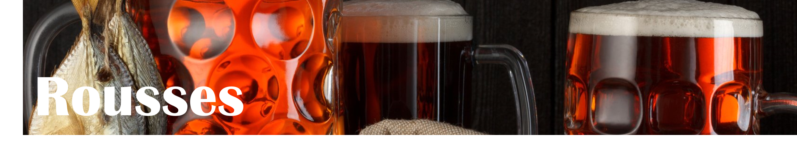

# Bières rousses

## American Red Ale 🇺🇸

* Description
  * goûts de caramel, de cassonade et de malts rôtis
  * notes de noisette
  * amertume modérée à forte
* Quoi acheter ?
  * La Bonne Aventure (Pit Caribou)

## Irish Red Ale 🇮🇪

* Description
  * goûts de caramel, de sucre d'orge et de malts rôtis et torréfiés
  * arômes de noisettes, de terre et une pointe de café 
  * amertume modérée à forte
* Quoi acheter ?
  * Rousse du Prosprecteur (Prosprecteur)
  * Rousse Irlandaise (Milles Îles)
  * Gros Pin (La Souche)

## Altbier 🇩🇪

* Description
  * goûts de caramel, de mélasse, de malt rôti et de pain grillé
  * arômes de tabac, de poivre, de pain et de noix
  * amertume fruitée et forte
* Quoi acheter ?
  * Fleury (Silo)
  * Ostalgia Rousse (Hopfenstar
  * Sticke Alt (LTM)
  * Altbier (Simple Malt)

  ## Märzen 🇩🇪

* Description
  * goût de caramel, de malts grillés, de pain et de biscuits
  * désaltérante et légère
  * [crisp and clean](decrire.md)
  * amertume modérée
* Quoi acheter ?
  * Märzen (Dunham)
  * Märzen (Vrooden)
  * 10 - Hoptoberfest (Harricana)
  * Oktoberfest (LTM)

## Rauchbier 💨

* Description
  * goût de fumée, [toffee](decrire.md) et de caramel et érable crémeux
* Quoi acheter ?
  * ce style est plutôt rare, demandez à votre détaillant voir ce qui est disponible

## Rye Beer

* Description
  * goût de seigle grillé, de caramel, de fumée et de poivre
  * amertume modérée à forte
* Quoi acheter ?
  *  Poivre (Menaud)
  * King Congne (Kruhnen)
  * Conqueror (Pit Caribou)
  * La Vache Folle:RyePA (Charlevoix)
  * Faishion Victim (Les Grands Bois)

## Yam Beer/Pumpkin Beer 🎃

* Description
  * goût de citrouille et d'épices d'automne (clou de girofle et cannelle principalement)
  * douce
  * amertume modérée à forte
* Quoi acheter ?
  * KNIGHTMARE (4 Origines)
  * Toussaint (La Souche)
  * Ale-Ô-Ween (Treffle Noir)

## Best Bitter 🇬🇧

* Description
  * goût de caramel et de malt rôti
  * notes de terre
  * houblons fruités anglais
  * légère
  * amertume modérée (ironique pas vrai ?)
* Quoi acheter ?
  * Albion (Albion)
  * Géante Rouge (L'Octant)
  * 5 (Harricana)
  * English Best Bitter (Mille Îles)  

## Steinbier 🪨

* Histoire
  * Des roches sont ajoutées pendant le [mash](brassage.md) (la cuisson des grains)
* Description
  * goût de caramel et de malt grillés
  * goût de houblons fruités
  * notes de feuilles de thé
  * amertume modérée à forte
* Quoi acheter ?
  * Voivoid Lost Machine (Hopfenstark)

## Sahti

* Description
  * goût de banane, de caramel, de malt rôti et d'alcool fort
  * amertume forte
* Quoi acheter ?
  * Sahti (Oshlag)

## Vienna Lager 🇦🇹

* Description
  * goûts de caramel, de malts fruités et céréaliers, de pain grillé et de biscuits sucrés
  * [crisp and clean](decrire.md)
  * amertume élevée
* Quoi acheter ?
  * n'importe laquelle de 5e Baron
  * India Viena Lager (Maltstorm)
  * La Vieille Usine (Pit Caribou)
  * Vienna Lager (Vrooden)
  * Drak (L 'Amère à Boire)

## Adambier

* Description
  * goût de caramel, de fumée, de malts rôtis et d'alcool fort
  * boisée et tourbée
  * amertume forte
* Quoi acheter ?
  * Adambier (Vox Populi)
