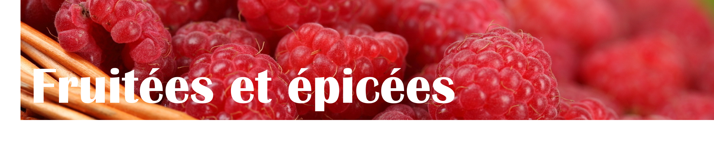

# Bières fruitées et épicées

### Des bières difficiles à trouver

Plusieurs bières sont difficiles à trouver parce que soi les brasseries ne vendent que sur place ou parce que les produits sont plutôt rares. Voici une liste d'excellentes brasseries qui font des blondes, mais qui sont difficiles à trouver:

* Auval
  * C'est la meilleure brasserie du Québec ! Tous leurs produits sont exceptionnels et leur Espinnay est très très populaire dans les [échanges](echanges.md).
* 3 Fonteinen, Tilquin et Cantillon
  * D'excellentes brasseries européennes qui ont des fois des produits à la SAQ ou chez de gros détaillants. Ces produits sont si rares qu'il y a des concours pour gagner la chance de les acheter !
* Small Pony Barrel Works
  * Une brasserie ontarienne qui se spécialise dans des bières **très acides**. Leurs produits sont extraordinaires si vous pouvez supporter l'acidité !
* etc.

## Smoothie Beer 🥤

* Description
  * immense goût des fruits qui la composent
  * aucune acidité
  * texture onctueuse, mousse épaisse, bière bourrante et délicieuse
  * amertume absente
* Quoi acheter ?
  * n'importe quelle BrewJuice, BrewCake ou Cobbler de Brewskey
  * n'importe quelle Why so Salty ou Petit Jus de Mort de Messorem
  * n'importe laquelle de Les Insulaires
  * d'autres brasseries font des Smoothie Beer, demandez à vos détaillants ils ont quoi en stock !

## Fruit Beer

* Description
  * goût des fruits qui la composent
  * faible acidité
  * texture entre celle des Lager commerciales (par exemple) et celle des Smoothie Beer
  * amertume très faible
* Quoi acheter ?
  * n'importe quoi de Auval
  * n'importe quoi de Bas-Canada
  * Gigafruits Raptor (La Barberie)
  * Megafruits Raptor (La Barberie)
  * n'importe quoi d'Emporium
  * Fructus (Le Castor)
    * assez funky, ne pas juste boire celle-ci
  * Mango Jelly (OverHop)
  * Sûre aux Framboises (Shelton)
  * etc.

## Berliner Weisse

* Description
  * subtil goût de fruits qui la composent
  * sûre et acidulée
  * légère et rafraîchissante
  * amertume très faible
* Quoi acheter ?
  * n'importe quoi de Pit Caribou
  * Solstice d'été (Dieu du Ciel)
  * Camerise (Menaud) 
  * Limoilou Beach (La Souche)
  * Sorbet (Simple Malt)
  * Rocket (L'Octant)
  * Silo F (Silo)
    * rares sont les bières à la goyave !

### ℹ️ Petit mot sur les trois styles décrits ci-haut

Je trouve que les Fruit Beer et Berliner Weisse sont souvent mélangés. Je pense qu'une Berliner Weisse est plus acide, sûre et légère, tandis qu'un Fruit Beer a des goûts fruités pas mal plus prononcés et une texture un petit peu plus *crémeuse*. Pour la Smoothie Beer ce sont sa texture et son amertume absente qui la caractérisent.

Il y a énormément de différences entre les bières sûres: leur texture, leur goût, les ingrédients utilisés, leur acidité, l'utilisation du bois ou non... Je ne peux pas toutes les aborder ! Voici d'autres styles aussi sûrs ou fruités:

## Saison Brett 🪵

* Description
  * goût de griottes et de canneberges
  * sûre
  * [brettée]() et boisée
* Quoi acheter ?
  * Saison Brett (LTM)

## Gueuze 🍏

* Description
  * goût de pomme verte sûre et de citron
  * acide
* Quoi acheter ?
  * Ceci n'est pas une Gueuze (LTM)
  * Gueuze (3 Fonteinen)
  * n'importe laquelle de Cantillon
    * il y a des bouteilles de 375mL à 18$ et des 750mL à 56$, je vous conseille d'essayer d'autres Gueuzes avant de boire celles-ci ! Celle de LTM est très bien faite par exemple !

## Flander's Red Ale 🍷

Excellente bière pour initier les amateurs de vin rouge à la microbrasserie

* Description
  * goût de cerises et un peu de pommes rouges
  * texture vineuse et boisée
  * acide
* Quoi acheter ?
  * Cuvée des Jacobins Rouge (Omer Vander Ghinste)
    * SAQ
  * Rouge de Mékinac (À la Fût)
    * si vous aimez celle-ci, vous allez sûrement aimer les multiples dérivées que la brasserie a faites de cette bière !

## Gose 🧂

* Description
  * goût de sel, de coriandre, de citron et de lime
  * rafraîchissante
* Quoi acheter ?
  * n'importe laquelle de Pit Caribou
  * Woopelaï (Tête d'Allumette)
  * Mrs Thatcher (Bob Magnale)
  * Miss Ghost (La Pécheresse)
  * La Calaca (Noctem)
  * etc.

## Lambic Kriek 🍒

* Description
  * goût de cerises
  * acide et sèche
* Quoi acheter ?
  * Oude Kriek (3 Fonteinen)

## Lambic Framboise

* Description
  * goût de framboises
  * acide et sèche
  * la bière proposée est très sucrée, mais c'est la plus accessible au Québec
* Quoi acheter ?
  * Framboise (Lindemans)
    * SAQ

## American Wild Ale

* Description
  * goût fruité
  * acide, légère et sèche
  * si la bière est jeune elle goûtera plus le houblon, plus elle vieillit, plus elle goûtera boisé
* Quoi acheter ?
  * L'Exorciste (Dieu du Ciel)
  * n'importe laquelle de Small Pony Barrel Works
    * des fois vendues à la SAQ
  * Assemblage Numéro 6 (Dunham)
  * n'importe laquelle de Messorem
  * n'importe laquelle de Le Castor
  * n'importe laquelle de la série **7205.** de Harricana

## Farmhouse Ale Saison

* Description
  * arômes de fruits, herbacés, de minéraux et d'agrumes
  * légèrement épicée
* Quoi acheter ?
  * Espinnay (Auval)
    * the best of the best 🏆
  * Saison Macérée (Le Castor)
  * Saison Cerise (Robin)

## Witbier/Blanche 🍊

* Description
  * goût de pelure d'orange et de graines de coriandre
  * bière fruitée et épicée
  * faibles arômes de banane
* Quoi acheter ?
  * Hoegaarden (Hoegarden)
  * Blanche de Chambly (Unibroue)
  * La 475 Blanche de Pattro (Pit Caribou)

## Grisette 🍋⛏️🌿

* Description
  * goûts subtils d'agrumes: citron et orange
  * notes florales, épicées, minérales et herbacées
  * sèche et légère
* Quoi acheter ?
  * n'importe laquelle de Auval
  * n'importe laquelle de Robin
  * n'importe laquelle de Dunham
  * n'importe laquelle d'Isle de Garde

## Gruit/Ancient Herbed Beer

* Description
  * goût de citron, de gingembre, de pomme verte sûre et de cannelle
  * notes herbacées et épicées: anis étoilé et romarin
* Quoi acheter ?
  * Bière de Gazebo (L'Espace Public)

## Spiced Beer

* Description
  * goût d'épices: cannelle, poivre et romarin
  * notes florales et fruitées
* Quoi acheter ?
  * Belle Saison (À l'Abri de la tempête)
  * Sang de Lutin (Brouhaha)
  * il doit avoir d'autres bières chez les très grands détaillants

## Winter Warmer 🎄

* Description
  * goût de fruits confits, de sapin, de pain d'épices, de vanille, de cannelle et d'alcool fort
  * bière forte et intense
* Quoi acheter ?
  * Réserve de Noël (LTM)

## Bière de Table

* Description
  * goût de sarrasin et de bois
  * bière légère
* Quoi acheter ?
  * n'importe quoi de Robin
  * n'importe quoi de Auval
  * n'importe quoi de Dunham
  * Saison de Table (LTM)

## Flanders Oud Bruin

* Description
  * goût de malt grillé, de caramel et de fruits confits
  * bière sûre et acidulée
  * fruitée et boisée
  * amertume légère à modérée
* Quoi acheter ?
  * Lapsus (Benelux)
  * Oud Bruin (LTM)

## Stout/Porter sûre/fruitée 🍒

* Description
  * goût de chocolat, de gâteau forêt-noire et de cerise noire
  * légèrement acidulée
  * amertume modérée
* Quoi acheter ?
  * Kriek Porter (Pit Caribou)
  * Stout Framboise (Le Naufrageur)
