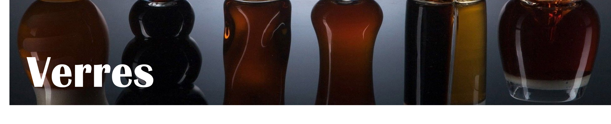
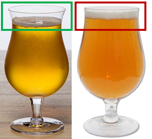
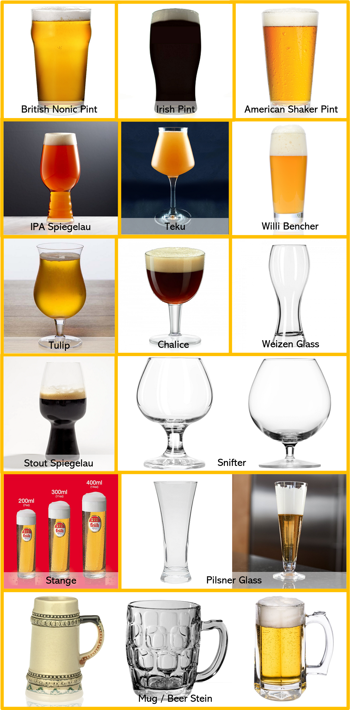
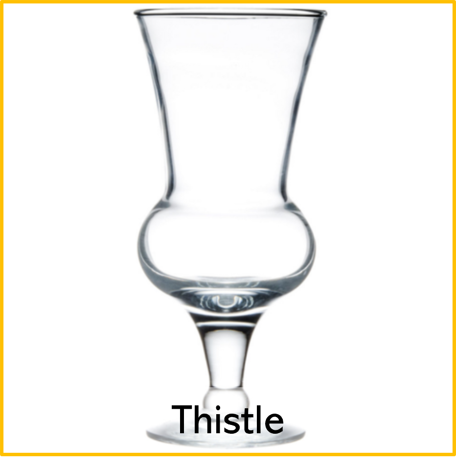

# Verres

Pour les meilleurs verres à utiliser pour chaque style je vous conseille de vous baser sur [ce guide-ci](https://justbeerapp.com/article/glassware-guide-which-beer-styles-should-be-served-in-what-glass), je le trouve excellent !

## Où les acheter ?

Normalement les verres se vendent entre 8\$ et 20\$ chez les détaillants de bière ou les brasseries. Il y a aussi des magasins qui en vendent, par exemple [Vinum](https://vinumdesign.com), ou [Tzanet](https://www.tzanet.com/). Personnellement, je suis allé chez *Renaissance* et j'ai tout acheté là ! C'est 0.50$ le verre à peu près, et vous pourriez trouver des petits bijoux ! Il y a aussi des groupes de trade sur Facebook: 
* [Collectionneurs De Verres De Bière Du Québec](https://www.facebook.com/groups/1696716747102786)
* [Echange Verre de Bière du Québec](https://www.facebook.com/groups/1598609583741693).

## Quel verre avoir ?

### 💰 petit budget

Si vous ne voulez pas dépenser beaucoup, je vous conseille d'y aller simplement: achetez-vous un **Teku** et mettez tout ce que vous buvez dedans !

*note1: regardez bien la capacité de vos verres ! N'oubliez pas que des canettes régulières sont de 473mL.*

*note2: assurez-vous d'avoir le petit bec dans vos Tulip et vos Teku. Je trouve que c'est pas mal plus agréable quand il est là !*

*Note3: SVP, ne buvez pas en canette ! En bouteille ça peut aller, mais surtout pas en canette ! Vous allez ajouter un goût métallique (et peut-être de rouille) à votre dégustation.*

### 💰💰 budget moyen

Si vous voulez y aller un petit peu plus loin, voici les 4 verres à avoir à mon avis:

* Pilsner pour n'importe quelle Lager Blonde et les Gose
* Nonic Pint pour vos Rousses, Brunes et Stout régulières
* Tulip pour vos sûres
* Teku pour les IPA, les Stouts de dégustation et tous les autres styles dont vous n’avez pas le bon verre

### 💰💰💰 gros budget

Si vous voulez avoir pas mal tous les verres [basez-vous sur ce guide-ci](https://justbeerapp.com/article/glassware-guide-which-beer-styles-should-be-served-in-what-glass) pour savoir lequel utiliser:

*note: normalement les Kölsh se boivent dans des Stange de 200mL et les Altbier dans ceux de 300mL ou 400mL.*

**Extra**

Le verre *Thistle* s'utilise pour des styles très spécifiques. Vous pouvez vous le procurer si vous y tenez, mais ce n'est pas nécessaire selon moi.

